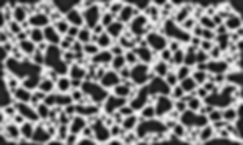

# wood_sculpture_pattern

This tool generates patterns to be used for "organic-looking", net-like wood sculptures.

## Installation

```
python3 -m pipenv install
```

## Usage

```
python3 -m pipenv run main.py
```

## Examples


